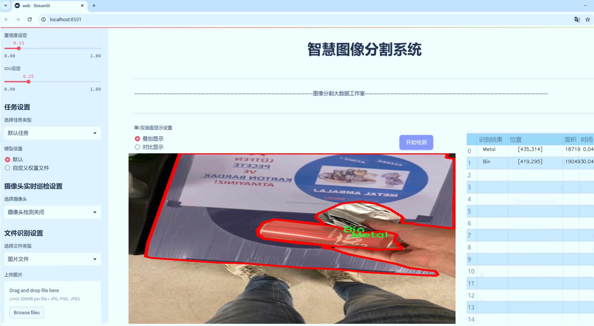

# 垃圾分类图像分割系统源码＆数据集分享
 [yolov8-seg-attention＆yolov8-seg-C2f-DAttention等50+全套改进创新点发刊_一键训练教程_Web前端展示]

### 1.研究背景与意义

项目参考[ILSVRC ImageNet Large Scale Visual Recognition Challenge](https://gitee.com/YOLOv8_YOLOv11_Segmentation_Studio/projects)

项目来源[AAAI Global Al lnnovation Contest](https://kdocs.cn/l/cszuIiCKVNis)

研究背景与意义

随着城市化进程的加快和人口的不断增长，垃圾产生量急剧增加，垃圾分类已成为现代社会面临的一项重要挑战。有效的垃圾分类不仅有助于资源的回收利用，减少环境污染，还能提高垃圾处理的效率，推动可持续发展。因此，开发高效、准确的垃圾分类系统显得尤为重要。近年来，深度学习技术的迅猛发展为图像处理领域带来了革命性的变化，尤其是在物体检测和图像分割方面。YOLO（You Only Look Once）系列模型以其高效的实时检测能力，逐渐成为计算机视觉领域的研究热点。

YOLOv8作为YOLO系列的最新版本，结合了更先进的网络结构和优化算法，具备了更强的特征提取能力和更高的检测精度。然而，现有的YOLOv8模型在垃圾分类的应用中仍存在一些不足之处，例如对复杂背景的适应性不足、对小物体的检测精度较低等。因此，基于YOLOv8的改进研究显得尤为重要，尤其是在垃圾分类图像分割的具体应用中。

本研究旨在基于改进的YOLOv8模型，构建一个高效的垃圾分类图像分割系统。我们将使用包含2400张图像的zibel数据集，该数据集涵盖了五类垃圾：垃圾桶、玻璃、金属、其他和塑料。这一数据集的多样性和丰富性为模型的训练和验证提供了良好的基础。通过对不同类别垃圾的图像进行实例分割，我们希望能够提高模型对垃圾分类的准确性和鲁棒性，尤其是在复杂环境下的表现。

在技术层面，我们将通过改进YOLOv8的网络结构，引入更为先进的特征提取模块和数据增强技术，以提升模型对不同类别垃圾的识别能力。同时，结合图像分割技术，我们将实现对垃圾图像的精确分割，使得每一类垃圾在图像中都能被清晰地识别和定位。这一创新不仅能提高垃圾分类的准确性，还能为后续的自动化垃圾处理提供重要的技术支持。

本研究的意义在于，不仅为垃圾分类提供了一种新的解决方案，还为深度学习在环境保护领域的应用开辟了新的方向。通过构建高效的垃圾分类图像分割系统，我们希望能够推动智能垃圾分类技术的发展，助力城市环境管理的智能化和自动化。此外，本研究还将为相关领域的研究者提供宝贵的数据和经验，促进学术界与产业界的合作，共同应对日益严峻的环境问题。

综上所述，基于改进YOLOv8的垃圾分类图像分割系统的研究，不仅具有重要的理论价值，也具备广泛的实际应用前景。通过这一研究，我们期望能够为实现更高效的垃圾分类和资源回收贡献一份力量，推动社会的可持续发展。

### 2.图片演示





##### 注意：由于此博客编辑较早，上面“2.图片演示”和“3.视频演示”展示的系统图片或者视频可能为老版本，新版本在老版本的基础上升级如下：（实际效果以升级的新版本为准）

  （1）适配了YOLOV8的“目标检测”模型和“实例分割”模型，通过加载相应的权重（.pt）文件即可自适应加载模型。

  （2）支持“图片识别”、“视频识别”、“摄像头实时识别”三种识别模式。

  （3）支持“图片识别”、“视频识别”、“摄像头实时识别”三种识别结果保存导出，解决手动导出（容易卡顿出现爆内存）存在的问题，识别完自动保存结果并导出到tempDir中。

  （4）支持Web前端系统中的标题、背景图等自定义修改，后面提供修改教程。

  另外本项目提供训练的数据集和训练教程,暂不提供权重文件（best.pt）,需要您按照教程进行训练后实现图片演示和Web前端界面演示的效果。

### 3.视频演示

[3.1 视频演示](https://www.bilibili.com/video/BV1HKyPYhEjr/)

### 4.数据集信息展示

##### 4.1 本项目数据集详细数据（类别数＆类别名）

nc: 5
names: ['Bin', 'Glass', 'Metal', 'Other', 'Plastic']


##### 4.2 本项目数据集信息介绍

数据集信息展示

在现代社会中，垃圾分类已成为环保和可持续发展的重要组成部分。为了提高垃圾分类的效率和准确性，研究人员致力于开发先进的图像分割系统，其中基于YOLOv8-seg的改进模型正是一个典型的应用案例。在这一背景下，"zibel"数据集的构建显得尤为重要，它为训练和评估垃圾分类图像分割系统提供了丰富的样本和多样的类别信息。

"zibel"数据集包含五个主要的垃圾分类类别，分别是：Bin（垃圾桶）、Glass（玻璃）、Metal（金属）、Other（其他）和Plastic（塑料）。这些类别不仅涵盖了日常生活中常见的垃圾类型，还反映了当前垃圾分类的实际需求。通过对这些类别的细致划分，"zibel"数据集为研究人员提供了一个多维度的视角，以便更好地理解和处理不同类型的垃圾。

在数据集的构建过程中，研究团队注重样本的多样性和代表性，确保每个类别都有足够的图像数据来支持模型的训练。这些图像不仅来源于不同的环境和场景，还考虑到了光照、角度和背景等多种因素，从而增强了模型的鲁棒性和适应性。例如，在Glass类别中，数据集包括了各种形状和颜色的玻璃瓶、罐子等物品，而在Plastic类别中，则涵盖了不同类型的塑料包装和容器。这种多样化的样本选择使得模型能够更好地学习到每个类别的特征，提高了分类的准确性。

此外，"zibel"数据集还提供了详细的标注信息，每张图像都经过精确的分割和标记，确保了训练过程中模型能够获取到准确的输入数据。这种高质量的标注不仅提升了模型的学习效果，也为后续的评估和测试提供了可靠的基准。通过对每个类别的细致标注，研究人员能够深入分析模型在不同垃圾类型上的表现，从而针对性地进行优化和改进。

在使用"zibel"数据集进行YOLOv8-seg模型的训练时，研究人员可以通过调整模型参数和训练策略，进一步提升图像分割的精度和效率。随着训练的深入，模型将逐渐掌握各个类别的特征，从而在实际应用中实现更高效的垃圾分类。这不仅有助于提升垃圾处理的效率，也为推动社会的可持续发展贡献了力量。

总之，"zibel"数据集的构建和应用为垃圾分类图像分割系统的研究提供了坚实的基础。通过丰富的类别信息和高质量的样本，研究人员能够不断优化和改进YOLOv8-seg模型，使其在实际应用中发挥更大的作用。随着技术的不断进步和数据集的不断完善，未来的垃圾分类系统将更加智能化，为我们的生活环境带来积极的变化。


### 5.全套项目环境部署视频教程（零基础手把手教学）

[5.1 环境部署教程链接（零基础手把手教学）](https://www.bilibili.com/video/BV1jG4Ve4E9t/?vd_source=bc9aec86d164b67a7004b996143742dc)


[5.2 安装Python虚拟环境创建和依赖库安装视频教程链接（零基础手把手教学）](https://www.bilibili.com/video/BV1nA4VeYEze/?vd_source=bc9aec86d164b67a7004b996143742dc)

### 6.手把手YOLOV8-seg训练视频教程（零基础小白有手就能学会）

[6.1 手把手YOLOV8-seg训练视频教程（零基础小白有手就能学会）](https://www.bilibili.com/video/BV1cA4VeYETe/?vd_source=bc9aec86d164b67a7004b996143742dc)


按照上面的训练视频教程链接加载项目提供的数据集，运行train.py即可开始训练



     Epoch   gpu_mem       box       obj       cls    labels  img_size
     1/200     0G   0.01576   0.01955  0.007536        22      1280: 100%|██████████| 849/849 [14:42<00:00,  1.04s/it]
               Class     Images     Labels          P          R     mAP@.5 mAP@.5:.95: 100%|██████████| 213/213 [01:14<00:00,  2.87it/s]
                 all       3395      17314      0.994      0.957      0.0957      0.0843

     Epoch   gpu_mem       box       obj       cls    labels  img_size
     2/200     0G   0.01578   0.01923  0.007006        22      1280: 100%|██████████| 849/849 [14:44<00:00,  1.04s/it]
               Class     Images     Labels          P          R     mAP@.5 mAP@.5:.95: 100%|██████████| 213/213 [01:12<00:00,  2.95it/s]
                 all       3395      17314      0.996      0.956      0.0957      0.0845

     Epoch   gpu_mem       box       obj       cls    labels  img_size
     3/200     0G   0.01561    0.0191  0.006895        27      1280: 100%|██████████| 849/849 [10:56<00:00,  1.29it/s]
               Class     Images     Labels          P          R     mAP@.5 mAP@.5:.95: 100%|███████   | 187/213 [00:52<00:00,  4.04it/s]
                 all       3395      17314      0.996      0.957      0.0957      0.0845


### 7.50+种全套YOLOV8-seg创新点代码加载调参视频教程（一键加载写好的改进模型的配置文件）

[7.1 50+种全套YOLOV8-seg创新点代码加载调参视频教程（一键加载写好的改进模型的配置文件）](https://www.bilibili.com/video/BV1Hw4VePEXv/?vd_source=bc9aec86d164b67a7004b996143742dc)

### 8.YOLOV8-seg图像分割算法原理

原始YOLOv8-seg算法原理

YOLOv8-seg算法是YOLO系列中的一项重要进展，旨在通过结合目标检测与图像分割的能力，提升在复杂场景下的目标识别与定位精度。该算法的设计理念是将目标检测任务转化为一个回归问题，利用深度学习模型同时预测目标的位置、类别及其分割掩码。YOLOv8-seg的核心在于其网络结构的创新，主要由Backbone、Neck和Head三个部分组成，各部分通过精心设计的模块实现了高效的特征提取与融合。

在Backbone部分，YOLOv8-seg采用了一系列卷积和反卷积层，结合残差连接和瓶颈结构，以减小网络的大小并提高性能。具体而言，Backbone由5个CBS模块、4个C2f模块和1个快速空间金字塔池化(SPPF)模块构成。CBS模块负责基本的特征提取，而C2f模块则在C3模块的基础上引入了更多的残差连接，使得网络在保持轻量化的同时，能够获得更丰富的梯度信息。这种设计不仅提高了特征提取的效率，还增强了模型在处理复杂图像时的鲁棒性。SPPF模块则通过多尺度特征的提取，进一步提升了网络对不同尺寸目标的适应能力。

Neck部分采用了多尺度特征融合技术，旨在将来自Backbone不同阶段的特征图进行有效融合，以便更好地捕捉不同尺度目标的信息。这一部分的设计灵感来源于PAN-FPN结构，通过特征金字塔的构建，YOLOv8-seg能够在不同层次上对特征进行整合，从而提升目标检测的性能和鲁棒性。多尺度特征融合的策略使得模型能够更好地处理复杂场景下的目标，尤其是在目标尺寸变化较大的情况下，能够有效提高检测的准确性。

在Head部分，YOLOv8-seg引入了解耦合头结构，将分类和回归任务分离开来。传统的YOLO系列通常将这两个任务耦合在一起，导致在复杂场景下可能出现定位不准及分类错误的问题。通过解耦，YOLOv8-seg能够使各个任务更加专注，从而提高整体的检测性能。此外，YOLOv8-seg采用了Anchor-free目标检测方法，这一创新使得模型不再依赖于预先定义的锚点框来预测目标的位置。传统方法中，锚点框的选择和调整往往复杂且繁琐，而YOLOv8-seg通过直接回归目标的位置和大小，简化了这一过程，使得网络能够更快地聚焦于目标位置的邻近点，从而生成更接近实际边界框的预测结果。

在训练过程中，YOLOv8-seg引入了动态Task-Aligned Assigner样本分配策略，以优化训练效果。在数据增强方面，算法采用了在最后10个epoch关闭马赛克增强的策略，进一步提升了模型的稳定性和准确性。损失函数的设计上，YOLOv8-seg使用了BCELoss作为分类损失，DFLLoss与CIoULoss作为回归损失，这种多重损失函数的组合有效地提升了模型在目标检测和分割任务中的表现。

总的来说，YOLOv8-seg算法通过对网络结构的深度优化与创新，成功地将目标检测与图像分割结合在一起，形成了一种高效、准确的目标识别与定位方案。其在Backbone、Neck和Head三个部分的设计上均体现了对性能与效率的追求，使得YOLOv8-seg在处理复杂场景下的目标检测任务时，能够展现出更强的鲁棒性与适应性。通过这些创新，YOLOv8-seg不仅提升了目标检测的精度，也为实时检测应用提供了更为可靠的解决方案，满足了在各种嵌入式设备上部署的需求。随着YOLOv8-seg的推广与应用，未来在智能监控、自动驾驶、无人机等领域的目标检测与分割任务中，其潜力将得到进一步的挖掘与发挥。


### 9.系统功能展示（检测对象为举例，实际内容以本项目数据集为准）

图9.1.系统支持检测结果表格显示

  图9.2.系统支持置信度和IOU阈值手动调节

  图9.3.系统支持自定义加载权重文件best.pt(需要你通过步骤5中训练获得)

  图9.4.系统支持摄像头实时识别

  图9.5.系统支持图片识别

  图9.6.系统支持视频识别

  图9.7.系统支持识别结果文件自动保存

  图9.8.系统支持Excel导出检测结果数据


### 10.50+种全套YOLOV8-seg创新点原理讲解（非科班也可以轻松写刊发刊，V11版本正在科研待更新）

#### 10.1 由于篇幅限制，每个创新点的具体原理讲解就不一一展开，具体见下列网址中的创新点对应子项目的技术原理博客网址【Blog】：


[10.1 50+种全套YOLOV8-seg创新点原理讲解链接](https://gitee.com/qunmasj/good)

#### 10.2 部分改进模块原理讲解(完整的改进原理见上图和技术博客链接)【如果此小节的图加载失败可以通过CSDN或者Github搜索该博客的标题访问原始博客，原始博客图片显示正常】
### YOLOv8简介
在各种目标检测算法中，YOLO系列因其速度和准确度间的优异平衡脱颖而出，能够准确、快速的识别目标，便于部署到各种移动设备中，已经广泛应用于各种领域的目标检测、跟踪和分割。目前最新版本 YOLOv8由原v5的开发团队Ultralytics于2023年1月提出，按规格大小可划分为n、s、m、1和x5个版本，是目前最先进的目标检测算法，有着优异的性能，很适合用于无人机航拍图像目标检测。其网络结构如图所示。

YOLOv8模型包括Input、Backbone、Neck 和Head4部分。其中 Input选用了Mosaic数据增强方法，并且对于不同大小的模型，有部分超参数会进行修改，典型的如大模型会开启 MixUp 和CopyPaste数据增强，能够丰富数据集，提升模型的泛化能力和鲁棒性。Backbone主要用于提取图片中的信息，提供给Neck和Head使用，由多个Conv、C2f模块和尾部的SPPF组成。Conv模块由单个Conv2d、
BatchNorm2d和激活函数构成,用丁是双行在万E5特征图;YOLOv8参考了C3模块的残左绒以心YOLOv7[16l的ELAN思想，设计出了C2f 结构，可以在保证轻量化的同时获得更加丰富的梯度流信息，并根据模型尺度来调整通道数，大幅提升了模型性能;SPPF是空间金字塔池化，能够融合不同尺度的特征。Neck部分主要起特征融合的作用，充分利用了骨干网络提取的特征，采用FPN[17]+PAN[18〕结构，
能够增强多个尺度上的语义表达和定位能力。Head输出端根据前两部分处理得到的特征来获取检测目标的类别和位置信息，做出识别,换以小旦公来和定解耦头结构,将分类和检测头分:9w‘无锅框的位关注侧重点不同的问题，同时也采用了无锚框的目标检测（Anchor-Free)，能够提升检测速度。Loss计算方面采用了正负样本动态分配策略，使用 VFLLoss 作为分类损失，使用DFLLoss+CIOU Loss作为回归损失。

### AutoFocus: Efficient Multi-Scale Conv简介

参考该博客提出了AutoFocus，一种高效的多尺度目标检测算法。相较于以前对整个图像金字塔进行处理，该方法以一种由表及里的姿态，仅处理哪些整体上看来很有可能存在小物体的区域。这个可以通过预测一张类别未知的分割图FocusPixels来得到。为了高效利用FocusPixels，另外一个算法用于产生包含FocusPixels的FocusChips，这样可以减少计算量并处理更更精细的尺度。在不同尺度上FocusChips所得到的检测结果综合时，会出现问题，我们也提供了解决问题的方案。AutoFocus在COCO上的结果有49.7%mAP（50%重叠下68.3%），与多尺度baseline相仿但是快了2.5倍。金字塔中处理的像素数量减少了5倍mAP只下降1%，在与RetinaNet采用相同的ResNet-101结构且速度相同时，高了10%mAP。

人类寻找物体是一个动态的过程，且寻找时间与场景的复杂度是直接相关的。当我们的眼神在不同的点之间漂移时，其他的区域会被我们有意忽视。然而，现在的检测算法是一种静态的推理过程且图像金字塔中的每个像素都受到了一样的对待，这使得过程变得没有效率。现在许多的应用都不强调实时性，而计算上的节省其实可以产生很大收益。

在COCO数据集中，虽然40%的物体都是小物体，但是它们一共只占了全图的0.3%。如果金字塔是3倍关系，则在高分辨率层要进行9倍的运算。XXX 。那么有没有办法在低分辨率下找出可能含有这些物体的区域呢？

以人眼方案类比，我们可以从低分辨率图像开始，找出有可能存在物体的区域再“聚集”到高分辨率。我们的AutoFocus会在一层中计算小物体的分割图FocusPixels，而在每一个FocusPixels上会用一个算法产生下一层所需要关注的chips。在COCO的最大分辨率层上我们可以只处理**20%的像素而性能不下降，如果只处理5%**也只下降1%而已。


图像金字塔与卷积神经网络对CV十分重要。然而卷积神经网络无法做到对尺度不敏感，所以为了不同大小的物体需要依赖图像金字塔。虽然训练已经有了高效的方法，但是其推断时间依然远离实际使用标准。

目标检测加速有很长历史了。常用的有特征近似以减少尺度、级联、特征金字塔，且最后一个最近很多人研究。

AutoFocus为速度与精度之间提供了一个平滑的折衷，指出可以在低分辨率下看出小物体的所在，从而节约计算。FocusPixels的计算较为容易。

先简单介绍一下SNIP，是一种多尺度的训练、推断算法。主要思想是训练针对某个特定scale的检测器而不是scale-invariant检测器。这样训练样本就局限于在某个尺度范围内，以适于这个检测器处理。比如在高分辨率仅处理小物体而高分辨率仅处理大物体，其优势在于训练时不用考虑尺度的变化。

由于训练时物体大小是已知的，我们在图像金字塔中可以忽略大量区域而只处理物体周围的区域。SNIPER说明这样低分辨率的训练与全图训练相比并不会降低性能。同样，在推断过程中如果可以在大分辨率图像上预测可能出现小物体的chip，我们也就不用处理整张高分辨率图片。在训练时，许多物体会被裁剪、扭曲，这可以当作是一种数据扩增，然而当这个情况在推断时出现，则会产生错误，所以我们还需要一个算法来整合不同尺度上的检测结果。

#### AutoFocus框架
如SIFT、SURF等传统分类特征包含两个组件，一个detector和一个descriptor。detector只包含轻量级的操作如DoG、LoG，用于在整张图片上找到感兴趣的区域；descriptor，一般来说计算量比较大，则只需要关注那些咸兴趣的区域。这个级联结构保障了图片处理的效率。

同样，AutoFocus框架也是用于预测感兴趣的区域，并丢弃在下一尺度不可能存在物体的区域，并将裁剪和缩放后的区域传递给下一尺度。AutoFocus由三个部分组成：FocusPixels，FocusChips和focus stacking。

#### FocusPixels
FocusPixels定义在卷积网络特征图的粒度之上（如conv5），如果特征图上某个像素与小物体有重叠则标注为一个FocusPixel。（小物体：面积处于一个网络的输入范围之内）。训练过程中，FocusPixels标注为正，某些与不在面积范围内的物体有重叠的像素标注为无效，其他像素标注为负。AutoFocus的训练目标是使在FocusPixels区域产生较大的激活值。

如果同时多个物体与同一像素重叠，优先给正标注。我们的网络输入是512x512，然后a,b,c取值分别是5,64,90。对于太大或太小的物体，我们认为当前尺度上没有足够人信息进行判断，所以会标定为无效。整个网络结构如下图。训练时加两层带ReLU的卷积(3x3和1x1)以及一个二分类softmax来预测FocusPixels。


#### FocusChip生成
推断过程中，我们标注输出概率大于阈值t的像素（这个参数可以控制加速比），得到一些连通域。对于每一个域，我们做一次膨胀使其包含一些有助于识别的周围信息，膨胀后相连的部分要合并。然后，我们生成一些包含连通域的chips（不同chips可能重叠，如有重叠则合并）。有些chip可能太小缺少必要信息，并使chip的大小变化很大，为了效率我们要求保证一个最小的chip size。算法流程如下：


#### 级联推断过程
我们的过程类似于图片金字塔的推断过程但是在过程中一步步去除不关注的图片区域。我们在最低分辨率上进行检测并生成chips，然后在这些chips再进行检测和生成chips。

#### Focus Stacking
这种级联分类器的一个问题是在chip边缘本来的大物体可能生成一些被剪裁的检测目标。在下一个尺度上，由于剪裁过了，所以会检测到小的、错误的正例False Positive。之前算法中的第二步膨胀其实就是为了保证没有物体会出现在chip的边缘。这样，当我们在局部图片chip的边缘检测到物体时，就可以把这个检测结果丢弃，即使其在SNIP的范围内。

也有一些物体在图片边缘的特殊情况。如果chip和图片共享一条边的话，我们会检查检测结果的其他边是否完全在里面，如果在，则保留它，否则丢弃。

在每一尺度得到有效检测结果后，我们可以将不同尺度上的结果进行整合，将这些结果映射到原图坐标系上。最后，非极大值抑制NMS用于聚集。网络结构如之前的图片所示。


### 11.项目核心源码讲解（再也不用担心看不懂代码逻辑）

#### 11.1 ui.py

以下是经过简化和注释的核心代码部分：

```python
import sys
import subprocess
from QtFusion.path import abs_path

def run_script(script_path):
    """
    使用当前 Python 环境运行指定的脚本。

    Args:
        script_path (str): 要运行的脚本路径
    """
    # 获取当前 Python 解释器的路径
    python_path = sys.executable

    # 构建运行命令，使用 streamlit 运行指定的脚本
    command = f'"{python_path}" -m streamlit run "{script_path}"'

    # 执行命令并等待其完成
    result = subprocess.run(command, shell=True)
    
    # 检查命令执行结果，如果返回码不为0，表示出错
    if result.returncode != 0:
        print("脚本运行出错。")

# 主程序入口
if __name__ == "__main__":
    # 获取要运行的脚本的绝对路径
    script_path = abs_path("web.py")

    # 调用函数运行指定的脚本
    run_script(script_path)
```

### 代码注释说明：
1. **导入模块**：
   - `sys`：用于获取当前 Python 解释器的路径。
   - `subprocess`：用于执行外部命令。
   - `abs_path`：从 `QtFusion.path` 模块导入，用于获取文件的绝对路径。

2. **`run_script` 函数**：
   - 接受一个参数 `script_path`，表示要运行的 Python 脚本的路径。
   - 使用 `sys.executable` 获取当前 Python 解释器的路径。
   - 构建命令字符串，使用 `streamlit` 模块运行指定的脚本。
   - 使用 `subprocess.run` 执行命令，并检查返回码以判断是否成功。

3. **主程序入口**：
   - 当脚本作为主程序运行时，获取 `web.py` 的绝对路径。
   - 调用 `run_script` 函数执行该脚本。

这个文件是一个 Python 脚本，主要功能是运行一个名为 `web.py` 的 Streamlit 应用。首先，脚本导入了必要的模块，包括 `sys`、`os` 和 `subprocess`，这些模块提供了与系统交互的功能。`abs_path` 函数从 `QtFusion.path` 模块中导入，用于获取文件的绝对路径。

在 `run_script` 函数中，传入一个脚本路径作为参数。该函数的目的是使用当前的 Python 环境来运行指定的脚本。首先，它通过 `sys.executable` 获取当前 Python 解释器的路径，然后构建一个命令字符串，这个命令使用 `streamlit` 来运行指定的脚本。具体来说，命令的格式是 `"{python_path}" -m streamlit run "{script_path}"`，其中 `{python_path}` 和 `{script_path}` 会被实际的路径替换。

接下来，使用 `subprocess.run` 方法执行构建好的命令，并通过 `shell=True` 参数允许在 shell 中执行命令。执行后，函数检查返回码，如果返回码不为 0，表示脚本运行出错，程序会打印出相应的错误信息。

在脚本的最后部分，使用 `if __name__ == "__main__":` 来确保当该脚本作为主程序运行时才会执行以下代码。这里指定了要运行的脚本路径为 `web.py`，并调用 `run_script` 函数来执行它。

总的来说，这个文件的主要功能是启动一个 Streamlit 应用，具体是通过调用 `web.py` 文件来实现的。

#### 11.2 ultralytics\models\rtdetr\predict.py

以下是代码中最核心的部分，并附上详细的中文注释：

```python
import torch
from ultralytics.data.augment import LetterBox
from ultralytics.engine.predictor import BasePredictor
from ultralytics.engine.results import Results
from ultralytics.utils import ops

class RTDETRPredictor(BasePredictor):
    """
    RT-DETR（实时检测变换器）预测器，扩展自BasePredictor类，用于使用百度的RT-DETR模型进行预测。
    该类利用视觉变换器的强大功能，提供实时物体检测，同时保持高精度。
    支持高效的混合编码和IoU感知查询选择等关键特性。
    """

    def postprocess(self, preds, img, orig_imgs):
        """
        对模型的原始预测结果进行后处理，以生成边界框和置信度分数。

        该方法根据置信度和类进行过滤，如果在`self.args`中指定了类。

        参数:
            preds (torch.Tensor): 模型的原始预测结果。
            img (torch.Tensor): 处理后的输入图像。
            orig_imgs (list或torch.Tensor): 原始的未处理图像。

        返回:
            (list[Results]): 包含后处理边界框、置信度分数和类标签的Results对象列表。
        """
        # 获取预测结果的维度
        nd = preds[0].shape[-1]
        # 分离边界框和分数
        bboxes, scores = preds[0].split((4, nd - 4), dim=-1)

        # 如果输入图像不是列表，则转换为numpy数组
        if not isinstance(orig_imgs, list):
            orig_imgs = ops.convert_torch2numpy_batch(orig_imgs)

        results = []
        for i, bbox in enumerate(bboxes):  # 遍历每个边界框
            # 将边界框从xywh格式转换为xyxy格式
            bbox = ops.xywh2xyxy(bbox)
            # 获取最大分数和对应的类
            score, cls = scores[i].max(-1, keepdim=True)
            # 根据置信度进行过滤
            idx = score.squeeze(-1) > self.args.conf
            # 如果指定了类，则进一步过滤
            if self.args.classes is not None:
                idx = (cls == torch.tensor(self.args.classes, device=cls.device)).any(1) & idx
            # 过滤后的预测结果
            pred = torch.cat([bbox, score, cls], dim=-1)[idx]
            orig_img = orig_imgs[i]
            oh, ow = orig_img.shape[:2]  # 获取原始图像的高度和宽度
            # 将预测的边界框坐标缩放到原始图像尺寸
            pred[..., [0, 2]] *= ow
            pred[..., [1, 3]] *= oh
            img_path = self.batch[0][i]  # 获取图像路径
            # 将结果添加到列表中
            results.append(Results(orig_img, path=img_path, names=self.model.names, boxes=pred))
        return results

    def pre_transform(self, im):
        """
        在将输入图像输入模型进行推理之前，对其进行预处理。
        输入图像被调整为方形比例，并进行缩放填充。尺寸必须为方形（640）并且填充。

        参数:
            im (list[np.ndarray] | torch.Tensor): 输入图像，形状为(N,3,h,w)的张量，或[(h,w,3) x N]的列表。

        返回:
            (list): 预处理后的图像列表，准备进行模型推理。
        """
        # 创建LetterBox对象，用于调整图像
        letterbox = LetterBox(self.imgsz, auto=False, scaleFill=True)
        # 对每个图像进行letterbox处理
        return [letterbox(image=x) for x in im]
```

### 代码核心部分解释：
1. **RTDETRPredictor类**：该类是一个预测器，专门用于RT-DETR模型的推理，继承自`BasePredictor`。
2. **postprocess方法**：对模型的原始预测结果进行后处理，生成边界框和置信度分数，并根据置信度和类进行过滤。
3. **pre_transform方法**：对输入图像进行预处理，确保图像为方形并进行缩放，以适应模型的输入要求。

这个程序文件是一个用于实时目标检测的预测器，名为 `RTDETRPredictor`，它继承自 `BasePredictor` 类，主要用于使用百度的 RT-DETR 模型进行预测。RT-DETR 模型结合了视觉变换器的优势，能够在保持高精度的同时实现实时目标检测。该类支持高效的混合编码和 IoU（Intersection over Union）感知查询选择等关键特性。

在代码中，首先导入了必要的库和模块，包括 PyTorch、数据增强模块、基础预测器、结果处理模块以及一些工具函数。接着定义了 `RTDETRPredictor` 类，并在类文档中详细描述了其功能和用法。使用示例展示了如何实例化预测器并调用预测方法。

类中包含两个主要方法：`postprocess` 和 `pre_transform`。`postprocess` 方法用于对模型的原始预测结果进行后处理，生成边界框和置信度分数。该方法首先从预测结果中分离出边界框和分数，然后根据置信度和指定的类别进行过滤。最终，返回一个包含后处理结果的 `Results` 对象列表。

`pre_transform` 方法则负责在将输入图像传递给模型进行推理之前，对其进行预处理。具体来说，它使用 `LetterBox` 类将输入图像调整为正方形并进行缩放，以确保符合模型的输入要求。该方法返回经过预处理的图像列表，准备好进行模型推理。

整体而言，这个文件实现了一个高效的目标检测预测器，能够处理输入图像并输出检测结果，适用于需要实时检测的应用场景。

#### 11.3 ultralytics\models\yolo\detect\val.py

以下是经过简化和注释的核心代码部分：

```python
import os
import torch
from ultralytics.engine.validator import BaseValidator
from ultralytics.utils import LOGGER, ops
from ultralytics.utils.metrics import DetMetrics, box_iou
from ultralytics.utils.plotting import output_to_target, plot_images

class DetectionValidator(BaseValidator):
    """
    继承自BaseValidator类，用于基于检测模型的验证。
    """

    def __init__(self, dataloader=None, save_dir=None, args=None):
        """初始化检测模型所需的变量和设置。"""
        super().__init__(dataloader, save_dir, args)
        self.metrics = DetMetrics(save_dir=self.save_dir)  # 初始化检测指标
        self.iouv = torch.linspace(0.5, 0.95, 10)  # 定义IoU向量，用于计算mAP@0.5:0.95

    def preprocess(self, batch):
        """对YOLO训练的图像批次进行预处理。"""
        # 将图像数据移动到设备上并进行归一化处理
        batch['img'] = batch['img'].to(self.device, non_blocking=True) / 255
        # 将其他必要的数据也移动到设备上
        for k in ['batch_idx', 'cls', 'bboxes']:
            batch[k] = batch[k].to(self.device)
        return batch

    def postprocess(self, preds):
        """对预测输出应用非极大值抑制（NMS）。"""
        return ops.non_max_suppression(preds, self.args.conf, self.args.iou)

    def update_metrics(self, preds, batch):
        """更新检测指标。"""
        for si, pred in enumerate(preds):
            idx = batch['batch_idx'] == si  # 获取当前批次的索引
            cls = batch['cls'][idx]  # 获取当前批次的类标签
            bbox = batch['bboxes'][idx]  # 获取当前批次的边界框
            npr = pred.shape[0]  # 当前批次的预测数量

            if npr == 0:  # 如果没有预测
                continue

            # 处理预测框
            predn = pred.clone()  # 克隆预测数据
            ops.scale_boxes(batch['img'][si].shape[1:], predn[:, :4], batch['ori_shape'][si])  # 将预测框缩放到原始图像大小

            # 计算IoU并更新指标
            if cls.shape[0] > 0:  # 如果有真实标签
                correct_bboxes = self._process_batch(predn, torch.cat((cls, bbox), 1))  # 处理当前批次
            self.metrics.process(predn, cls)  # 更新指标

    def _process_batch(self, detections, labels):
        """
        返回正确预测矩阵。
        """
        iou = box_iou(labels[:, 1:], detections[:, :4])  # 计算IoU
        return self.match_predictions(detections[:, 5], labels[:, 0], iou)  # 匹配预测与标签

    def get_stats(self):
        """返回指标统计信息和结果字典。"""
        stats = [torch.cat(x, 0).cpu().numpy() for x in zip(*self.stats)]  # 转换为numpy数组
        if len(stats) and stats[0].any():
            self.metrics.process(*stats)  # 处理指标
        return self.metrics.results_dict  # 返回结果字典

    def print_results(self):
        """打印每个类的训练/验证集指标。"""
        LOGGER.info(f'All: {self.seen}, Metrics: {self.metrics.mean_results()}')  # 打印总体结果
```

### 代码注释说明：
1. **DetectionValidator类**：这是一个用于检测模型验证的类，继承自`BaseValidator`。
2. **__init__方法**：初始化一些必要的变量，包括检测指标和IoU向量。
3. **preprocess方法**：对输入的图像批次进行预处理，包括将图像数据移动到设备上并进行归一化。
4. **postprocess方法**：对模型的预测结果应用非极大值抑制，以去除冗余的检测框。
5. **update_metrics方法**：更新检测指标，包括处理预测框和计算IoU。
6. **_process_batch方法**：计算IoU并返回正确的预测矩阵。
7. **get_stats方法**：返回当前的指标统计信息和结果字典。
8. **print_results方法**：打印训练或验证集的总体指标。

这个程序文件是Ultralytics YOLO模型的验证模块，主要用于在目标检测任务中评估模型的性能。文件中定义了一个名为`DetectionValidator`的类，该类继承自`BaseValidator`，并实现了一系列用于处理验证数据、计算指标和输出结果的方法。

在初始化方法中，`DetectionValidator`接收一些参数，包括数据加载器、保存目录、进度条、参数和回调函数。它设置了一些与验证相关的变量，如每个类别的目标数量、是否为COCO数据集、类别映射等。同时，它还初始化了一些评估指标，如检测指标和混淆矩阵。

`preprocess`方法用于对输入的图像批次进行预处理，包括将图像转换为适合模型输入的格式，并将标签和边界框移动到相应的设备上。如果设置了保存混合标签的选项，还会生成用于自动标注的标签。

`init_metrics`方法用于初始化评估指标，检查数据集是否为COCO格式，并根据模型的类别名称设置相应的指标。

`get_desc`方法返回一个格式化的字符串，用于总结YOLO模型的类别指标。

`postprocess`方法对模型的预测结果应用非极大值抑制（NMS），以减少冗余的检测框。

`update_metrics`方法用于更新评估指标。它遍历每个预测结果，计算正确的边界框，并将结果存储在统计信息中。如果设置了保存JSON或TXT文件的选项，还会将预测结果保存到相应的文件中。

`finalize_metrics`方法用于设置最终的指标值，包括速度和混淆矩阵。

`get_stats`方法返回指标统计信息和结果字典，计算每个类别的目标数量。

`print_results`方法打印训练或验证集的每个类别的指标，包括检测到的图像数量和目标数量。如果没有找到标签，会发出警告。

`_process_batch`方法用于返回正确的预测矩阵，计算IoU（交并比）并匹配预测与标签。

`build_dataset`和`get_dataloader`方法用于构建YOLO数据集和返回数据加载器，支持不同的批次大小和模式。

`plot_val_samples`和`plot_predictions`方法用于绘制验证图像样本和预测结果，并将结果保存为图像文件。

`save_one_txt`方法将YOLO检测结果保存为TXT文件，格式为归一化坐标。

`pred_to_json`方法将YOLO预测结果序列化为COCO JSON格式，便于后续评估。

`eval_json`方法用于评估YOLO输出的JSON格式，并返回性能统计信息，使用pycocotools库计算mAP（平均精度均值）。

整体来看，这个文件实现了YOLO模型在目标检测任务中的验证流程，包括数据预处理、指标计算、结果输出等功能，适用于训练后对模型性能的评估。

#### 11.4 ultralytics\utils\metrics.py

以下是经过简化并添加详细中文注释的核心代码部分：

```python
import numpy as np
import torch

def box_iou(box1, box2, eps=1e-7):
    """
    计算两个边界框的交并比（IoU）。
    
    参数：
        box1 (torch.Tensor): 形状为 (N, 4) 的张量，表示 N 个边界框。
        box2 (torch.Tensor): 形状为 (M, 4) 的张量，表示 M 个边界框。
        eps (float, optional): 避免除以零的小值，默认为 1e-7。

    返回：
        (torch.Tensor): 形状为 (N, M) 的张量，包含 box1 和 box2 中每对边界框的 IoU 值。
    """
    # 获取边界框的坐标
    (a1, a2), (b1, b2) = box1.unsqueeze(1).chunk(2, 2), box2.unsqueeze(0).chunk(2, 2)
    
    # 计算交集区域
    inter = (torch.min(a2, b2) - torch.max(a1, b1)).clamp_(0).prod(2)

    # 计算 IoU = 交集 / (区域1 + 区域2 - 交集)
    return inter / ((a2 - a1).prod(2) + (b2 - b1).prod(2) - inter + eps)

def bbox_iou(box1, box2, xywh=True, eps=1e-7):
    """
    计算边界框的交并比（IoU）。
    
    参数：
        box1 (torch.Tensor): 形状为 (1, 4) 的张量，表示单个边界框。
        box2 (torch.Tensor): 形状为 (n, 4) 的张量，表示 n 个边界框。
        xywh (bool, optional): 如果为 True，输入框为 (x, y, w, h) 格式；如果为 False，输入框为 (x1, y1, x2, y2) 格式。默认为 True。
        eps (float, optional): 避免除以零的小值，默认为 1e-7。

    返回：
        (torch.Tensor): IoU 值。
    """
    # 将 (x, y, w, h) 转换为 (x1, y1, x2, y2) 格式
    if xywh:
        (x1, y1, w1, h1), (x2, y2, w2, h2) = box1.chunk(4, -1), box2.chunk(4, -1)
        b1_x1, b1_x2, b1_y1, b1_y2 = x1 - w1 / 2, x1 + w1 / 2, y1 - h1 / 2, y1 + h1 / 2
        b2_x1, b2_x2, b2_y1, b2_y2 = x2 - w2 / 2, x2 + w2 / 2, y2 - h2 / 2, y2 + h2 / 2
    else:
        b1_x1, b1_y1, b1_x2, b1_y2 = box1.chunk(4, -1)
        b2_x1, b2_y1, b2_x2, b2_y2 = box2.chunk(4, -1)

    # 计算交集区域
    inter = (b1_x2.minimum(b2_x2) - b1_x1.maximum(b2_x1)).clamp_(0) * \
            (b1_y2.minimum(b2_y2) - b1_y1.maximum(b2_y1)).clamp_(0)

    # 计算并集区域
    union = (b1_x2 - b1_x1) * (b1_y2 - b1_y1 + eps) + (b2_x2 - b2_x1) * (b2_y2 - b2_y1 + eps) - inter + eps

    # 计算 IoU
    return inter / union

def compute_ap(recall, precision):
    """
    计算平均精度（AP）给定召回率和精度曲线。
    
    参数：
        recall (list): 召回率曲线。
        precision (list): 精度曲线。

    返回：
        (float): 平均精度。
        (np.ndarray): 精度包络曲线。
        (np.ndarray): 修改后的召回率曲线。
    """
    # 在开头和结尾添加哨兵值
    mrec = np.concatenate(([0.0], recall, [1.0]))
    mpre = np.concatenate(([1.0], precision, [0.0]))

    # 计算精度包络
    mpre = np.flip(np.maximum.accumulate(np.flip(mpre)))

    # 计算曲线下面积
    x = np.linspace(0, 1, 101)  # 101 点插值
    ap = np.trapz(np.interp(x, mrec, mpre), x)  # 积分

    return ap, mpre, mrec
```

### 代码核心部分解释：
1. **box_iou**: 计算两个边界框之间的交并比（IoU），用于评估目标检测模型的性能。
2. **bbox_iou**: 计算单个边界框与多个边界框之间的 IoU，支持不同的输入格式（xywh 或 xyxy）。
3. **compute_ap**: 计算平均精度（AP），通过给定的召回率和精度曲线来评估模型的整体性能。

这些函数是目标检测中计算评估指标的基础，帮助开发者理解模型的准确性和性能。

这个程序文件是一个用于计算和评估模型性能的工具，主要针对目标检测、分类和分割任务。文件中定义了多个函数和类，提供了多种评估指标的计算方法。

首先，文件导入了一些必要的库，包括数学计算、警告处理、路径处理、绘图、NumPy和PyTorch等。接着，定义了一些常量和函数，例如计算交并比（IoU）和其他相关指标的函数。这些函数能够处理不同格式的边界框（bounding boxes），并计算它们之间的重叠区域、面积等。

在函数部分，`bbox_ioa`、`box_iou`和`bbox_iou`等函数用于计算边界框之间的交集和并集，从而得到IoU值。`get_inner_iou`和`bbox_inner_iou`则是计算内部IoU的变体，适用于不同的输入格式。`wasserstein_loss`函数实现了一种损失计算方法，用于优化模型的性能。

接下来，文件中定义了`ConfusionMatrix`类，用于计算和更新混淆矩阵，以评估分类和检测任务的性能。该类包含多个方法，用于处理分类预测、更新混淆矩阵、绘制混淆矩阵图等。

在评估指标方面，`Metric`类用于计算YOLOv8模型的评估指标，包括精度、召回率和平均精度（mAP）。该类提供了多种方法来获取不同的评估结果，并支持更新和计算模型的适应性。

此外，`DetMetrics`、`SegmentMetrics`和`PoseMetrics`类分别用于计算检测、分割和姿态估计任务的评估指标。这些类扩展了`Metric`类，提供了特定任务的处理方法和结果。

最后，`ClassifyMetrics`类用于计算分类任务的准确率，包括top-1和top-5准确率。它提供了处理目标和预测的方法，并计算相应的评估指标。

总体而言，这个程序文件提供了一整套用于目标检测、分类和分割任务的评估工具，能够帮助开发者有效地评估和优化模型性能。

#### 11.5 train.py

以下是经过简化并注释的核心代码部分：

```python
import os
import torch
import yaml
from ultralytics import YOLO  # 导入YOLO模型

if __name__ == '__main__':  # 确保该模块被直接运行时才执行以下代码
    # 设置训练参数
    workers = 1  # 数据加载的工作进程数
    batch = 8  # 每个批次的样本数量
    device = "0" if torch.cuda.is_available() else "cpu"  # 检查是否有可用的GPU

    # 获取数据集的YAML配置文件的绝对路径
    data_path = abs_path(f'datasets/data/data.yaml', path_type='current')

    # 读取YAML文件，保持原有顺序
    with open(data_path, 'r') as file:
        data = yaml.load(file, Loader=yaml.FullLoader)

    # 修改YAML文件中的路径项
    if 'train' in data and 'val' in data and 'test' in data:
        directory_path = os.path.dirname(data_path.replace(os.sep, '/'))  # 获取目录路径
        data['train'] = directory_path + '/train'  # 更新训练集路径
        data['val'] = directory_path + '/val'      # 更新验证集路径
        data['test'] = directory_path + '/test'    # 更新测试集路径

        # 将修改后的数据写回YAML文件
        with open(data_path, 'w') as file:
            yaml.safe_dump(data, file, sort_keys=False)

    # 加载YOLO模型
    model = YOLO(r"C:\codeseg\codenew\50+种YOLOv8算法改进源码大全和调试加载训练教程（非必要）\改进YOLOv8模型配置文件\yolov8-seg-C2f-Faster.yaml").load("./weights/yolov8s-seg.pt")

    # 开始训练模型
    results = model.train(
        data=data_path,  # 指定训练数据的配置文件路径
        device=device,  # 指定训练设备
        workers=workers,  # 数据加载的工作进程数
        imgsz=640,  # 输入图像的大小
        epochs=100,  # 训练的轮数
        batch=batch,  # 每个批次的样本数量
    )
```

### 代码注释说明：
1. **导入必要的库**：引入了操作系统、PyTorch、YAML解析库和YOLO模型。
2. **主程序入口**：使用`if __name__ == '__main__':`确保代码仅在直接运行时执行。
3. **设置训练参数**：
   - `workers`：指定数据加载的工作进程数。
   - `batch`：每个批次的样本数量，需根据显存情况调整。
   - `device`：根据是否有可用的GPU选择设备。
4. **获取数据集配置文件路径**：使用`abs_path`函数获取数据集的YAML文件的绝对路径。
5. **读取和修改YAML文件**：
   - 读取YAML文件内容并保持原有顺序。
   - 更新训练、验证和测试集的路径。
   - 将修改后的内容写回YAML文件。
6. **加载YOLO模型**：根据指定的配置文件和权重文件加载YOLO模型。
7. **训练模型**：调用`model.train`方法开始训练，传入训练数据路径、设备、工作进程数、图像大小、训练轮数和批次大小等参数。

这个程序文件 `train.py` 是一个用于训练 YOLO（You Only Look Once）目标检测模型的脚本。首先，它导入了必要的库，包括 `os`、`torch`、`yaml` 和 `ultralytics` 中的 YOLO 模型。它还使用 `matplotlib` 来设置图形后端为 `TkAgg`，以便在训练过程中可视化结果。

在 `__main__` 块中，程序首先定义了一些训练参数，包括工作进程数 `workers`、批次大小 `batch` 和设备 `device`。设备的选择基于是否有可用的 GPU，如果有则使用 GPU（设备编号为 "0"），否则使用 CPU。

接下来，程序构建了数据集配置文件的绝对路径 `data_path`，该路径指向一个 YAML 文件。然后，它将路径格式转换为 Unix 风格，并提取出目录路径 `directory_path`。程序打开 YAML 文件并读取其内容，使用 `yaml` 库保持原有的顺序。

如果 YAML 文件中包含 'train'、'val' 和 'test' 的键，程序会将这些键的值修改为相应的训练、验证和测试数据的路径，并将修改后的内容写回到 YAML 文件中。

接下来，程序加载 YOLO 模型，使用指定的配置文件和预训练权重文件。注意，程序中提到不同模型对设备的要求不同，如果当前模型无法在设备上运行，可以尝试其他模型配置。

最后，程序调用 `model.train()` 方法开始训练模型，传入训练数据的配置文件路径、设备、工作进程数、输入图像大小、训练的 epoch 数量和批次大小等参数。这一过程将开始模型的训练，直到达到指定的 epoch 数量。

#### 11.6 ultralytics\trackers\utils\gmc.py

以下是经过简化和注释的核心代码部分，主要集中在 `GMC` 类的初始化和主要方法上：

```python
import cv2
import numpy as np
from ultralytics.utils import LOGGER

class GMC:
    """
    通用运动补偿 (GMC) 类，用于视频帧中的跟踪和物体检测。
    """

    def __init__(self, method='sparseOptFlow', downscale=2):
        """初始化 GMC 对象，设置跟踪方法和缩放因子。"""
        self.method = method  # 设置跟踪方法
        self.downscale = max(1, int(downscale))  # 设置缩放因子，确保至少为1

        # 根据选择的方法初始化特征检测器和匹配器
        if self.method == 'orb':
            self.detector = cv2.FastFeatureDetector_create(20)
            self.extractor = cv2.ORB_create()
            self.matcher = cv2.BFMatcher(cv2.NORM_HAMMING)
        elif self.method == 'sift':
            self.detector = cv2.SIFT_create(nOctaveLayers=3, contrastThreshold=0.02, edgeThreshold=20)
            self.extractor = cv2.SIFT_create(nOctaveLayers=3, contrastThreshold=0.02, edgeThreshold=20)
            self.matcher = cv2.BFMatcher(cv2.NORM_L2)
        elif self.method == 'ecc':
            self.warp_mode = cv2.MOTION_EUCLIDEAN
            self.criteria = (cv2.TERM_CRITERIA_EPS | cv2.TERM_CRITERIA_COUNT, 5000, 1e-6)
        elif self.method == 'sparseOptFlow':
            self.feature_params = dict(maxCorners=1000, qualityLevel=0.01, minDistance=1, blockSize=3)
        elif self.method in ['none', 'None', None]:
            self.method = None
        else:
            raise ValueError(f'未知的 GMC 方法: {method}')

        # 初始化存储前一帧、关键点和描述符的变量
        self.prevFrame = None
        self.prevKeyPoints = None
        self.prevDescriptors = None
        self.initializedFirstFrame = False  # 标记是否已处理第一帧

    def apply(self, raw_frame, detections=None):
        """根据指定的方法在原始帧上应用物体检测。"""
        if self.method in ['orb', 'sift']:
            return self.applyFeatures(raw_frame, detections)  # 使用特征方法
        elif self.method == 'ecc':
            return self.applyEcc(raw_frame, detections)  # 使用ECC方法
        elif self.method == 'sparseOptFlow':
            return self.applySparseOptFlow(raw_frame, detections)  # 使用稀疏光流方法
        else:
            return np.eye(2, 3)  # 返回单位矩阵

    def applyEcc(self, raw_frame, detections=None):
        """应用ECC算法以估计帧间变换。"""
        height, width, _ = raw_frame.shape
        frame = cv2.cvtColor(raw_frame, cv2.COLOR_BGR2GRAY)  # 转换为灰度图
        H = np.eye(2, 3, dtype=np.float32)  # 初始化变换矩阵

        # 根据缩放因子调整图像大小
        if self.downscale > 1.0:
            frame = cv2.resize(frame, (width // self.downscale, height // self.downscale))

        # 处理第一帧
        if not self.initializedFirstFrame:
            self.prevFrame = frame.copy()  # 复制当前帧作为前一帧
            self.initializedFirstFrame = True  # 标记为已初始化
            return H

        # 使用ECC算法估计变换矩阵
        try:
            (cc, H) = cv2.findTransformECC(self.prevFrame, frame, H, self.warp_mode, self.criteria, None, 1)
        except Exception as e:
            LOGGER.warning(f'找不到变换，使用单位矩阵: {e}')

        return H

    def applyFeatures(self, raw_frame, detections=None):
        """应用特征检测方法以估计帧间变换。"""
        height, width, _ = raw_frame.shape
        frame = cv2.cvtColor(raw_frame, cv2.COLOR_BGR2GRAY)  # 转换为灰度图
        H = np.eye(2, 3)  # 初始化变换矩阵

        # 根据缩放因子调整图像大小
        if self.downscale > 1.0:
            frame = cv2.resize(frame, (width // self.downscale, height // self.downscale))

        # 处理第一帧
        if not self.initializedFirstFrame:
            self.prevFrame = frame.copy()  # 复制当前帧作为前一帧
            self.initializedFirstFrame = True  # 标记为已初始化
            return H

        # 检测关键点并计算描述符
        keypoints = self.detector.detect(frame)
        keypoints, descriptors = self.extractor.compute(frame, keypoints)

        # 匹配描述符
        knnMatches = self.matcher.knnMatch(self.prevDescriptors, descriptors, 2)
        # 过滤匹配，保留好的匹配
        goodMatches = [m for m, n in knnMatches if m.distance < 0.9 * n.distance]

        # 估计刚性变换矩阵
        if len(goodMatches) > 4:
            prevPoints = np.array([self.prevKeyPoints[m.queryIdx].pt for m in goodMatches])
            currPoints = np.array([keypoints[m.trainIdx].pt for m in goodMatches])
            H, _ = cv2.estimateAffinePartial2D(prevPoints, currPoints, cv2.RANSAC)

        # 更新前一帧和关键点
        self.prevFrame = frame.copy()
        self.prevKeyPoints = copy.copy(keypoints)
        self.prevDescriptors = copy.copy(descriptors)

        return H

    def applySparseOptFlow(self, raw_frame, detections=None):
        """应用稀疏光流方法以估计帧间变换。"""
        height, width, _ = raw_frame.shape
        frame = cv2.cvtColor(raw_frame, cv2.COLOR_BGR2GRAY)  # 转换为灰度图
        H = np.eye(2, 3)  # 初始化变换矩阵

        # 根据缩放因子调整图像大小
        if self.downscale > 1.0:
            frame = cv2.resize(frame, (width // self.downscale, height // self.downscale))

        # 检测关键点
        keypoints = cv2.goodFeaturesToTrack(frame, mask=None, **self.feature_params)

        # 处理第一帧
        if not self.initializedFirstFrame:
            self.prevFrame = frame.copy()  # 复制当前帧作为前一帧
            self.prevKeyPoints = copy.copy(keypoints)  # 复制当前关键点
            self.initializedFirstFrame = True  # 标记为已初始化
            return H

        # 计算光流
        matchedKeypoints, status, _ = cv2.calcOpticalFlowPyrLK(self.prevFrame, frame, self.prevKeyPoints, None)

        # 过滤有效的匹配点
        prevPoints = [self.prevKeyPoints[i] for i in range(len(status)) if status[i]]
        currPoints = [matchedKeypoints[i] for i in range(len(status)) if status[i]]

        # 估计刚性变换矩阵
        if len(prevPoints) > 4:
            H, _ = cv2.estimateAffinePartial2D(np.array(prevPoints), np.array(currPoints), cv2.RANSAC)

        # 更新前一帧和关键点
        self.prevFrame = frame.copy()
        self.prevKeyPoints = copy.copy(keypoints)

        return H
```

### 代码注释说明：
1. **类和方法说明**：在类和方法的文档字符串中，简要说明了它们的功能和参数。
2. **初始化方法**：在初始化方法中，设置了跟踪方法、缩放因子，并根据所选方法初始化了相应的特征检测器和匹配器。
3. **应用方法**：`apply` 方法根据选择的跟踪方法调用相应的处理函数。
4. **ECC 和特征方法**：`applyEcc` 和 `applyFeatures` 方法中，分别实现了基于ECC算法和特征匹配的运动估计，处理了第一帧的初始化和后续帧的变换矩阵计算。
5. **稀疏光流方法**：`applySparseOptFlow` 方法实现了基于稀疏光流的运动估计，处理了关键点的检测和光流计算。

以上是对核心代码的提炼和详细注释，希望对理解代码的功能和结构有所帮助。

这个程序文件定义了一个名为 `GMC` 的类，主要用于视频帧中的跟踪和物体检测。该类实现了多种跟踪算法，包括 ORB、SIFT、ECC 和稀疏光流，能够根据需要对帧进行下采样以提高计算效率。

在 `GMC` 类的构造函数中，用户可以指定跟踪方法和下采样因子。根据所选的方法，类会初始化相应的特征检测器、描述符提取器和匹配器。例如，如果选择 ORB 方法，则使用 OpenCV 的 ORB 创建器；如果选择 SIFT 方法，则使用 SIFT 创建器；如果选择 ECC 方法，则设置相关的迭代次数和终止条件；而稀疏光流方法则会设置特征参数。

类的主要属性包括当前帧、前一帧的关键点和描述符，以及一个标志位，指示是否已经处理了第一帧。类提供了一个 `apply` 方法，根据指定的方法对输入的原始帧进行处理，并返回变换矩阵。具体的处理逻辑则由 `applyEcc`、`applyFeatures` 和 `applySparseOptFlow` 等方法实现。

在 `applyEcc` 方法中，首先将原始帧转换为灰度图像，并根据下采样因子对图像进行处理。若当前帧是第一帧，则会初始化相关数据并返回单位矩阵。否则，使用 ECC 算法计算当前帧与前一帧之间的变换矩阵。

`applyFeatures` 方法同样会处理图像并提取关键点和描述符。它会使用匹配器找到前一帧和当前帧之间的匹配点，并根据空间距离过滤匹配结果。最后，使用 RANSAC 算法估计刚性变换矩阵。

`applySparseOptFlow` 方法则实现了稀疏光流的处理逻辑，使用 `cv2.calcOpticalFlowPyrLK` 函数计算关键点的光流，提取有效的匹配点，并同样使用 RANSAC 估计变换矩阵。

总的来说，`GMC` 类提供了一种灵活的方式来实现视频帧中的运动补偿和物体跟踪，支持多种算法，并能够根据需要调整处理的复杂度。

### 12.系统整体结构（节选）

### 整体功能和构架概括

该项目是一个基于Ultralytics YOLO和RT-DETR模型的目标检测框架，旨在提供高效的训练、验证和推理功能。项目的结构清晰，主要包括以下几个模块：

1. **用户界面（UI）**：通过 `ui.py` 文件提供了一个简单的界面来启动Streamlit应用。
2. **模型预测**：`predict.py` 文件实现了RT-DETR模型的实时目标检测功能。
3. **验证模块**：`val.py` 文件用于评估YOLO模型的性能，计算多种指标。
4. **评估指标**：`metrics.py` 文件提供了计算各种评估指标的工具，支持目标检测、分类和分割任务。
5. **训练流程**：`train.py` 文件负责模型的训练过程，设置参数并调用训练方法。
6. **跟踪算法**：`gmc.py` 文件实现了多种跟踪算法，用于视频帧中的物体跟踪。
7. **其他模块**：项目中还包含了Transformer模块、回调函数、DCNv3操作、NAS（神经架构搜索）验证、额外的模块块、调优器等。

### 文件功能整理表

| 文件路径                                               | 功能描述                                               |
|------------------------------------------------------|------------------------------------------------------|
| `C:\codeseg\codenew\code\ui.py`                     | 启动Streamlit应用的用户界面。                          |
| `C:\codeseg\codenew\code\ultralytics\models\rtdetr\predict.py` | 实现RT-DETR模型的实时目标检测功能。                     |
| `C:\codeseg\codenew\code\ultralytics\models\yolo\detect\val.py` | 评估YOLO模型性能，计算多种指标。                        |
| `C:\codeseg\codenew\code\ultralytics\utils\metrics.py` | 提供计算各种评估指标的工具，支持多种任务。              |
| `C:\codeseg\codenew\code\train.py`                  | 负责模型的训练过程，设置参数并调用训练方法。            |
| `C:\codeseg\codenew\code\ultralytics\trackers\utils\gmc.py` | 实现多种跟踪算法，用于视频帧中的物体跟踪。              |
| `C:\codeseg\codenew\code\ultralytics\nn\modules\transformer.py` | 实现Transformer模块，支持模型的特征提取和处理。         |
| `C:\codeseg\codenew\code\ultralytics\utils\callbacks\base.py` | 定义基础回调函数，用于训练过程中的监控和操作。           |
| `C:\codeseg\codenew\code\ultralytics\nn\extra_modules\ops_dcnv3\test.py` | 测试DCNv3操作的功能和性能。                             |
| `C:\codeseg\codenew\code\ultralytics\models\nas\val.py` | 验证NAS（神经架构搜索）模型的性能。                     |
| `C:\codeseg\codenew\code\ultralytics\nn\extra_modules\block.py` | 定义额外的模块块，用于构建神经网络。                     |
| `C:\codeseg\codenew\code\ultralytics\engine\tuner.py` | 实现模型调优的功能，优化模型性能。                      |
| `C:\codeseg\codenew\code\ultralytics\models\nas\__init__.py` | 初始化NAS模块，提供相关功能的入口。                     |

这个表格总结了每个文件的主要功能，展示了项目的整体架构和各个模块之间的关系。

注意：由于此博客编辑较早，上面“11.项目核心源码讲解（再也不用担心看不懂代码逻辑）”中部分代码可能会优化升级，仅供参考学习，完整“训练源码”、“Web前端界面”和“50+种创新点源码”以“14.完整训练+Web前端界面+50+种创新点源码、数据集获取”的内容为准。

### 13.图片、视频、摄像头图像分割Demo(去除WebUI)代码

在这个博客小节中，我们将讨论如何在不使用WebUI的情况下，实现图像分割模型的使用。本项目代码已经优化整合，方便用户将分割功能嵌入自己的项目中。
核心功能包括图片、视频、摄像头图像的分割，ROI区域的轮廓提取、类别分类、周长计算、面积计算、圆度计算以及颜色提取等。
这些功能提供了良好的二次开发基础。

### 核心代码解读

以下是主要代码片段，我们会为每一块代码进行详细的批注解释：

```python
import random
import cv2
import numpy as np
from PIL import ImageFont, ImageDraw, Image
from hashlib import md5
from model import Web_Detector
from chinese_name_list import Label_list

# 根据名称生成颜色
def generate_color_based_on_name(name):
    ......

# 计算多边形面积
def calculate_polygon_area(points):
    return cv2.contourArea(points.astype(np.float32))

...
# 绘制中文标签
def draw_with_chinese(image, text, position, font_size=20, color=(255, 0, 0)):
    image_pil = Image.fromarray(cv2.cvtColor(image, cv2.COLOR_BGR2RGB))
    draw = ImageDraw.Draw(image_pil)
    font = ImageFont.truetype("simsun.ttc", font_size, encoding="unic")
    draw.text(position, text, font=font, fill=color)
    return cv2.cvtColor(np.array(image_pil), cv2.COLOR_RGB2BGR)

# 动态调整参数
def adjust_parameter(image_size, base_size=1000):
    max_size = max(image_size)
    return max_size / base_size

# 绘制检测结果
def draw_detections(image, info, alpha=0.2):
    name, bbox, conf, cls_id, mask = info['class_name'], info['bbox'], info['score'], info['class_id'], info['mask']
    adjust_param = adjust_parameter(image.shape[:2])
    spacing = int(20 * adjust_param)

    if mask is None:
        x1, y1, x2, y2 = bbox
        aim_frame_area = (x2 - x1) * (y2 - y1)
        cv2.rectangle(image, (x1, y1), (x2, y2), color=(0, 0, 255), thickness=int(3 * adjust_param))
        image = draw_with_chinese(image, name, (x1, y1 - int(30 * adjust_param)), font_size=int(35 * adjust_param))
        y_offset = int(50 * adjust_param)  # 类别名称上方绘制，其下方留出空间
    else:
        mask_points = np.concatenate(mask)
        aim_frame_area = calculate_polygon_area(mask_points)
        mask_color = generate_color_based_on_name(name)
        try:
            overlay = image.copy()
            cv2.fillPoly(overlay, [mask_points.astype(np.int32)], mask_color)
            image = cv2.addWeighted(overlay, 0.3, image, 0.7, 0)
            cv2.drawContours(image, [mask_points.astype(np.int32)], -1, (0, 0, 255), thickness=int(8 * adjust_param))

            # 计算面积、周长、圆度
            area = cv2.contourArea(mask_points.astype(np.int32))
            perimeter = cv2.arcLength(mask_points.astype(np.int32), True)
            ......

            # 计算色彩
            mask = np.zeros(image.shape[:2], dtype=np.uint8)
            cv2.drawContours(mask, [mask_points.astype(np.int32)], -1, 255, -1)
            color_points = cv2.findNonZero(mask)
            ......

            # 绘制类别名称
            x, y = np.min(mask_points, axis=0).astype(int)
            image = draw_with_chinese(image, name, (x, y - int(30 * adjust_param)), font_size=int(35 * adjust_param))
            y_offset = int(50 * adjust_param)

            # 绘制面积、周长、圆度和色彩值
            metrics = [("Area", area), ("Perimeter", perimeter), ("Circularity", circularity), ("Color", color_str)]
            for idx, (metric_name, metric_value) in enumerate(metrics):
                ......

    return image, aim_frame_area

# 处理每帧图像
def process_frame(model, image):
    pre_img = model.preprocess(image)
    pred = model.predict(pre_img)
    det = pred[0] if det is not None and len(det)
    if det:
        det_info = model.postprocess(pred)
        for info in det_info:
            image, _ = draw_detections(image, info)
    return image

if __name__ == "__main__":
    cls_name = Label_list
    model = Web_Detector()
    model.load_model("./weights/yolov8s-seg.pt")

    # 摄像头实时处理
    cap = cv2.VideoCapture(0)
    while cap.isOpened():
        ret, frame = cap.read()
        if not ret:
            break
        ......

    # 图片处理
    image_path = './icon/OIP.jpg'
    image = cv2.imread(image_path)
    if image is not None:
        processed_image = process_frame(model, image)
        ......

    # 视频处理
    video_path = ''  # 输入视频的路径
    cap = cv2.VideoCapture(video_path)
    while cap.isOpened():
        ret, frame = cap.read()
        ......
```


### 14.完整训练+Web前端界面+50+种创新点源码、数据集获取


# [下载链接：https://mbd.pub/o/bread/Zp2YlJ5s](https://mbd.pub/o/bread/Zp2YlJ5s)